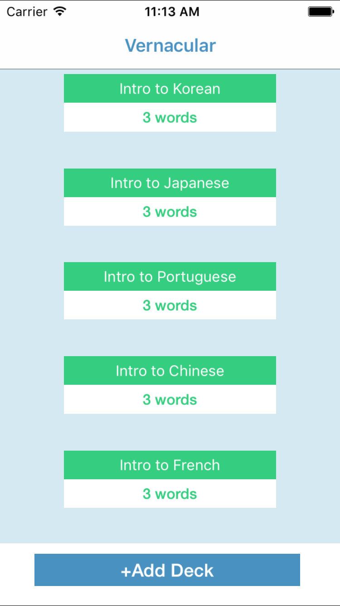
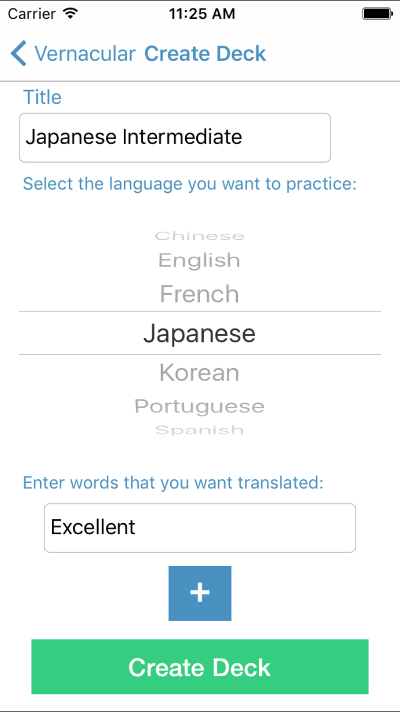
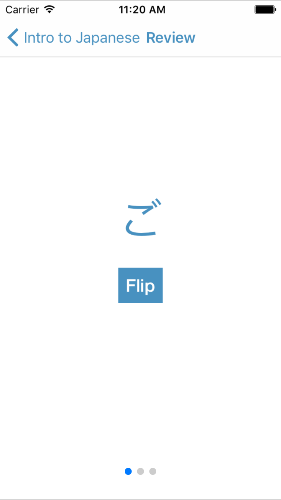

## Vernacular

#### //Running App for Development

- `npm install`
- `react-native run-ios --simulator`

Install react-native if you haven't already
- `npm install -g react-native`

Made by Aylan Mello and [Davin Kim](https://github.com/Davinism)

### Background

There are many apps out there for reviewing vocabulary flashcards. Our app specializes on short review bursts of foreign language vocabulary.

### Functionality & MVP

With this IOS app, users will be able to

- [ ] Create new vocabulary word sets (up to 10 words to a set)
- [ ] Add these to the community words sets
- [ ] Review their own and others' words

### Wireframes

### Technologies & Technical Challenges

This app will be implemented using React Native to bridge the gap between the web dev browser stack and IOS. The CRUD API for new words will be built in ExpressJS. The data will persist in a MongoDB instance on mlab.com (DaaS).

#### API endpoints

- `/words #POST` add wordCardSet to global set collection
- `/words #GET` get all wordCardSets  from DB

#### MongoDB Schema
`
{deck:
	{
		title: 'french 1'
		[{source: 'hello', dest: 'bonjour'}, {}...],
		id: '9232k3j3fdf'
	}
}
`

#### Redux State
`
{decks: [
	[{source: 'hello', dest: 'bonjour'}, {}...],
	[{source: 'bye', dest: 'adieu'}, {}...]
	],
	deckIdx: 0,
	cardIdx: 0
}
`

Side technologies:
- YANDEX API for translation

### Implementation Timeline

**Day 1**: Complete ExpressJS CRUD API.

- Connect Express POST request to yandex API to succesfully create decks.
- Test GET request for all decks in Chrome by hitting API endpoint repeatedly.
- Test extensively.

**Day 2**: Make front end connect to DB and post, read words correctly.

- The ability to, from the IOS app, make post requests that update the DB correctly.
- Validate input.

**Day 3**: Make welcome screen with all wordSets from DB.

- Home screen should display all decks.
- Infinite scroll to go down and view the available decks.

**Day 4**: Flash card view.

- Use SwipeScreen React Native Component to implement the View layer of each of the deck's cards.
- Make gameplay logic in React/Redux for each Card.
